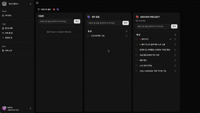
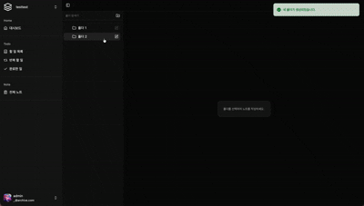
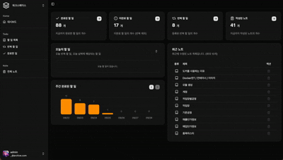

# Archive Front

Archive Front는 React19와 Typescript로 구축되었습니다.
FSD(Feature slide Design) 아키텍처를 채택하여 유지보수성과 확장성에 중점을 두었습니다.

# 데모
## 할일

## 노트

## 대시보드

# 기술스택
- 언어: TypeScript
- 프레임워크: React 19, Vite
- 라우트: React-Router-Dom
- UI: Tailwind CSS, Shadcn UI, Radix UI, Lucide
- 상태관리: Zustand
- 서버상태관리: Tanstack Query
- 폼/검증: Zod
- 에디터: Tiptap
- 데이터 시각화: Recharts
- 빌드/도구: Vite, ESLint, Typescript

# 주요기능
- 카테고리별 Todo 관리
- 반복 할 일 관리
- 완료한 일 히스토리
- 폴더 별 Note 관리
- 대시보드

# 프로젝트 구조
- app: 앱 레벨 프로바이더, 라우트 가드, 레이아웃
- entities: 도메인 엔티티와 타입
- features: 기능 모듈 (category, note, todo, user, workspace)
- widgets: 복합 UI 블록
- pages: 라우트 단위 페이지
- shared: 공용 UI, 라이브러리, 유틸

# 시작하기
사전준비
- Node.js 18+ 
- npm

의존성 설치
- npm install

환경변수
- .env.development.local / .env.production.local 

개발서버
- npm run dev

빌드
- npm run build

